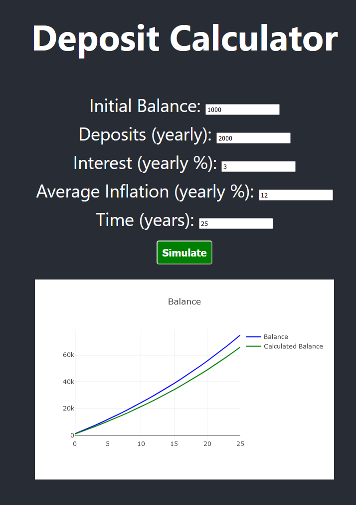

# system-dynamics-web-runner
Run system dynamics models from web and see the results

## How to run
 1. Run system-dynamics-web-runner\simulation-api\main.py
 2. Run npm start in system-dynamics-web-runner\react-system-model-sim\